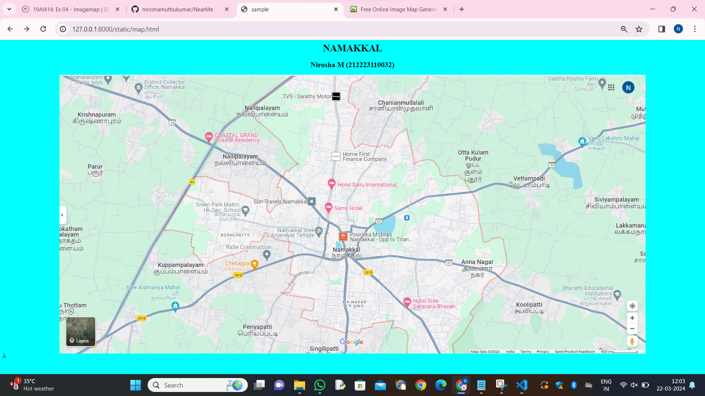
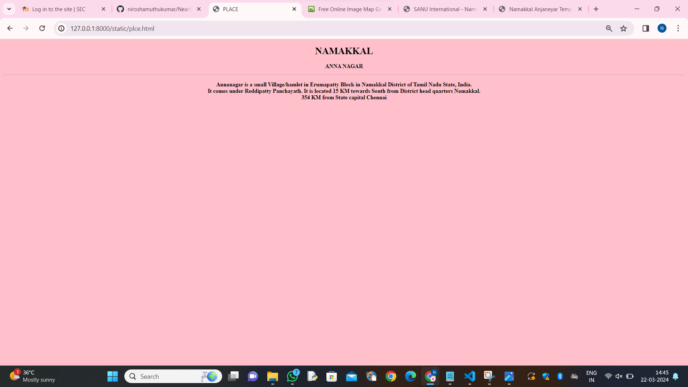
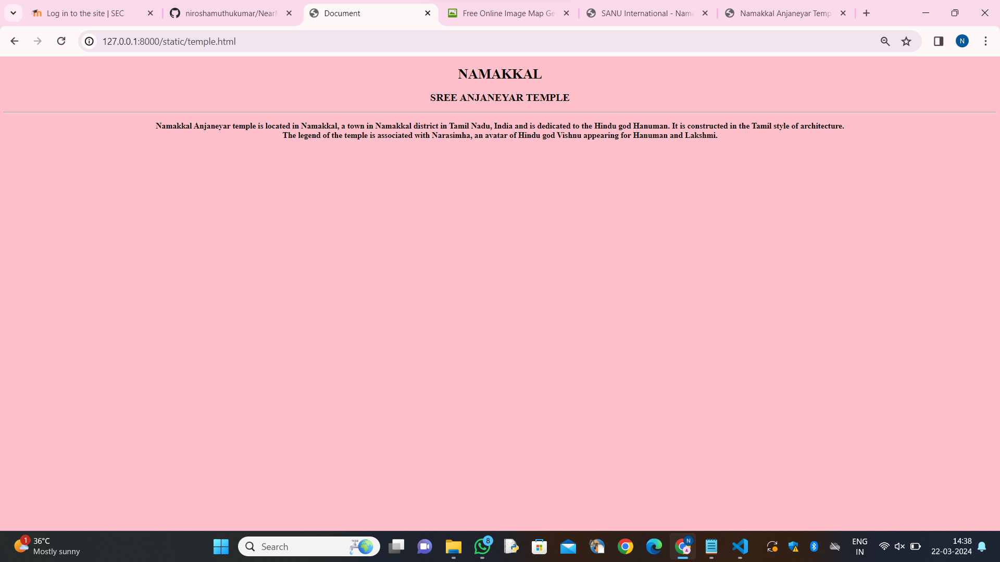

# Ex04 Places Around Me
## Date: 22/03/2024

## AIM
To develop a website to display details about the places around my house.

## DESIGN STEPS

### STEP 1
Create a Django admin interface.

### STEP 2
Download your city map from Google.

### STEP 3
Using ```<map>``` tag name the map.

### STEP 4
Create clickable regions in the image using ```<area>``` tag.

### STEP 5
Write HTML programs for all the regions identified.

### STEP 6
Execute the programs and publish them.

## CODE
```
<html>
    <head>
        <title>sample</title>
    </head>
    <h1 align="center">NAMAKKAL</h1>
    <h2 align="center">Nirosha M (212223110032)</h2>
    <body bgcolor="cyan">
        

        <map name="image-map">
            <area target="" alt="hotel sanu international" title="hotel sanu international" href="hotel.html" coords="1004,455,872,423" shape="rect">
            <area target="" alt="samy hotel" title="samy hotel" href="hotel.html" coords="" shape="poly">
            <area target="" alt="hotel sree saravana bhavana " title="hotel sree saravana bhavana " href="hotel.html" coords="1173,744,NaN" shape="circle">
            <area target="" alt="anna nagar" title="anna nagar" href="nagar.html" coords="684,536,835,501" shape="rect">
            <area target="" alt="namakkal sree aanjaneyar temple" title="namakkal sree aanjaneyar temple" href="temple" coords="NaN" shape="circle">
        </map>
    </map>
    </body>
</html>

```
```
<!DOCTYPE html>
<html lang="en">
<head>
   <title>HOTEL</title>
</head>
<body bgcolor="pink">
    <h1><center>NAMAKKAL</center></h1>
    <h2><center>Hotel Sanu International</center></h2>
    <hr>
    
<h3><center>SANU International, we pride ourselves on our unique service culture. <br>Redefining hospitality- is our service philosophy, which promises that each guest will be treated with a positive service attitude at every point of contact.<br> We will achieve high performance and provide world-class service by putting people first.</center></h3>
</body>
</html>
```
```
<!DOCTYPE html>
<html lang="en">
<head>
   <title>HOTEL1</title>
</head>
<body bgcolor="pink">
    <h1><center>NAMAKKAL</center></h1>   
    <h2><center>SREE SAVANA BHAVAN</center></h2>
    <hr>

    <h3><center>Hotel Saravana Bhavan is the largest South Indian restaurant chain in the world, founded in 1981 in Chennai, Tamil Nadu, India.<br>[1] The chain operates 33 locations in India (24 in Chennai) and 78 across 22 countries in North America, Southeast Asia, the Middle East, Europe, and Oceania.</center></h3>
</body>
</html>
```
```
<!DOCTYPE html>
<html lang="en">
<head>
   <title>SCHOOL</title>
</head>
<body bgcolor="pink">
    <h1><center>NAMAKKAL</center></h1>
    <h2><center>Green Park Matriculation higher secondary school</center></h2>
    <hr>
    
<h3><center>A school is both the educational institution and building designed to provide learning spaces and learning environments for the teaching of students under the direction of teachers.<br> Most countries have systems of formal education, which is sometimes compulsory.</center></h3>
</body>
</html>
```
```
<!DOCTYPE html>
<html lang="en">
<head>
   <title>PLACE</title>
</head>
<body bgcolor="pink">
    <h1><center>NAMAKKAL</center></h1>

<h3><center>ANNA NAGAR</center></h3>
<hr>

<h3><center>Annanagar is a small Village/hamlet in Erumapatty Block in Namakkal District of Tamil Nadu State, India.<br> It comes under Reddipatty Panchayath. It is located 15 KM towards South from District head quarters Namakkal.<br> 354 KM from State capital Chennai
</center></h3>
</body>
</html>
```
```
<!DOCTYPE html>
<html lang="en">
<head>
    <meta charset="UTF-8">
    <meta name="viewport" content="width=device-width, initial-scale=1.0">
    <title>Document</title>
</head>
<body bgcolor="pink">
    <h1><center>NAMAKKAL</center></h1>
    <h2><center>SREE ANJANEYAR TEMPLE</center></h2>
   <hr>
   
   <h3><center>Namakkal Anjaneyar temple is located in Namakkal, a town in Namakkal district in Tamil Nadu, India and is dedicated to the Hindu god Hanuman. It is constructed in the Tamil style of architecture.<br> The legend of the temple is associated with Narasimha, an avatar of Hindu god Vishnu appearing for Hanuman and Lakshmi.</center></h3>
</body>
</html>
```
## OUTPUT





## RESULT
The program for implementing image maps using HTML is executed successfully.
